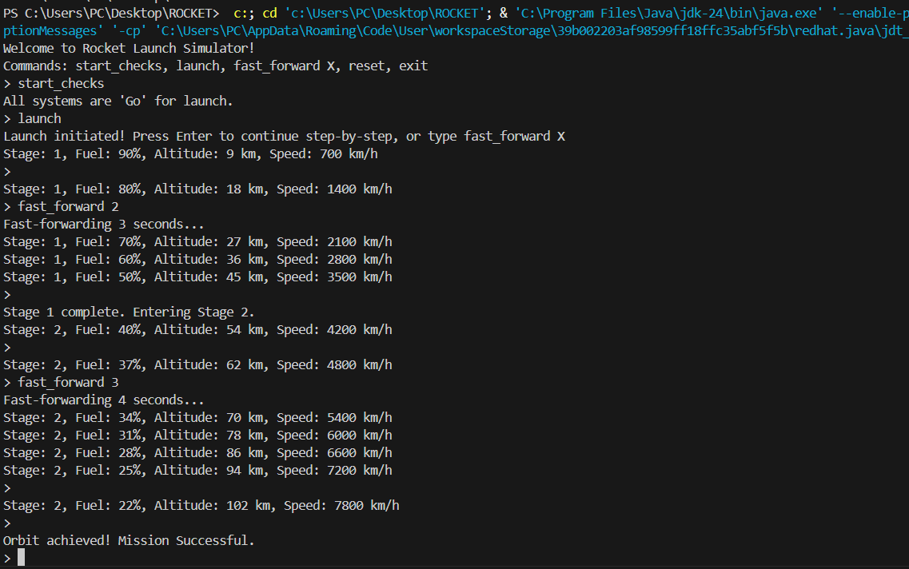
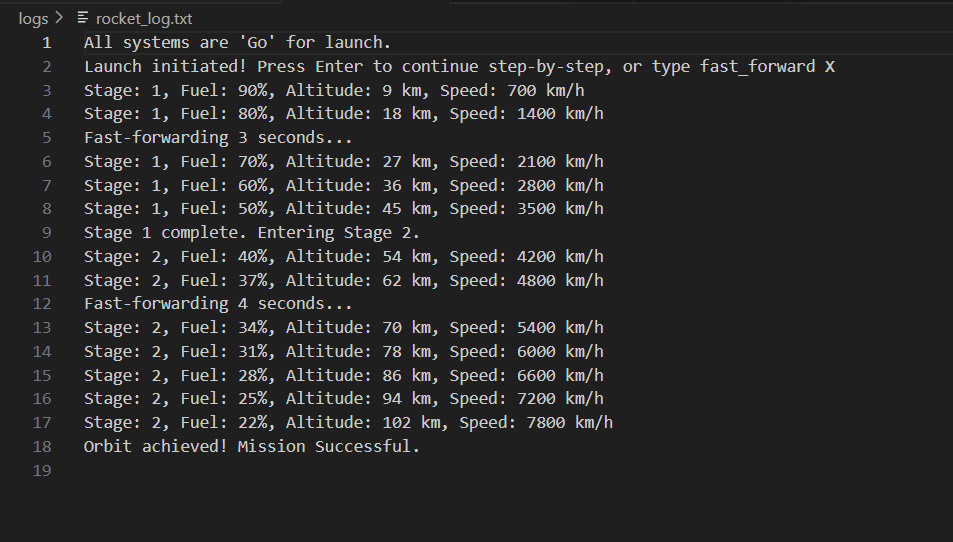
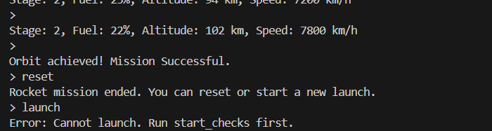

#  Rocket Launch Simulator

## Overview
The **Rocket Launch Simulator** is a terminal-based Java application simulating a rocket launch that places a satellite into orbit. The simulator operates in **discrete time steps**, providing real-time updates on **fuel, altitude, speed, and stage**. Users can **pause, advance step-by-step, or fast-forward** the simulation.

---

## Features
- **Step-by-Step Simulation:** Launch progresses one step at a time, pausing for user input.  
- **Fast Forward:** Advance multiple steps instantly using `fast_forward X`.  
- **Pre-Launch Checks:** Validate readiness before launch with `start_checks`.  
- **Telemetry Logging:** Observers log real-time updates of fuel, speed, altitude, and stage.  
- **Stage Separation:** Automatic handling of multi-stage rocket transitions.  
- **Mission Outcomes:** Handles successful orbit placement and mission failure due to fuel depletion.  
- **Resettable:** Reset the rocket state at any point.  

---

## Classes and Structure

| Class | Responsibility |
|-------|----------------|
| `Rocket` | Singleton class managing rocket state, simulating steps, and handling fast-forward requests. |
| `LaunchCommand` | Command pattern; initiates step-by-step rocket launch. |
| `FastForwardCommand` | Command pattern; requests rocket to fast-forward X steps. |
| `StartChecksCommand` | Command pattern; performs pre-launch system checks. |
| `Simulator` | Main loop handling user input, executing commands, and managing interactive session. |
| `RocketObserver` / `FileLogger` | Observer pattern; logs telemetry updates to file. |

---

## Design Patterns Followed
- **Singleton:** Ensures only one rocket instance exists (`Rocket`).  
- **Observer:** Observers receive telemetry updates (`RocketObserver` / `FileLogger`).  
- **Command:** Encapsulates actions (Launch, FastForward, StartChecks).  
- **Step-Based Control:** Enables interactive, pausable simulation.  

## Commands Summary

| Command | Description |
|---------|------------|
| `start_checks` | Perform pre-launch system checks. |
| `launch` | Start step-by-step rocket launch simulation. |
| `fast_forward X` | Skip X steps of simulation instantly. |
| `reset` | Reset rocket to pre-launch state. |
| `exit` | Exit the simulator. |

---

## Visual Flow Diagram

```text
          +----------------+
          |    Simulator   |
          +--------+-------+
                   |
                   v
         +---------+---------+
         |   User Input      |
         | start_checks,     |
         | launch,           |
         | fast_forward X,   |
         | reset             |
         +---------+---------+
                   |
    +--------------+--------------+
    |                             |
    v                             v
+------------+             +------------------+
|StartChecks |             | LaunchCommand    |
| Command    |             +--------+---------+
+------------+                      |
                   +----------------+
                   |
                   v
          +------------------+
          |    Rocket        |
          |----------------- |
          | - fuel, altitude |
          | - speed, stage   |
          | - status         |
          | - simulateStep() |
          | - fastForward()  |
          +--------+---------+
                   |
                   v
          +----------------+
          | RocketObservers|
          | (FileLogger)   |
          +----------------+

```

## OUTPUT SCREENSHOTS



File Logging


Reset Command

